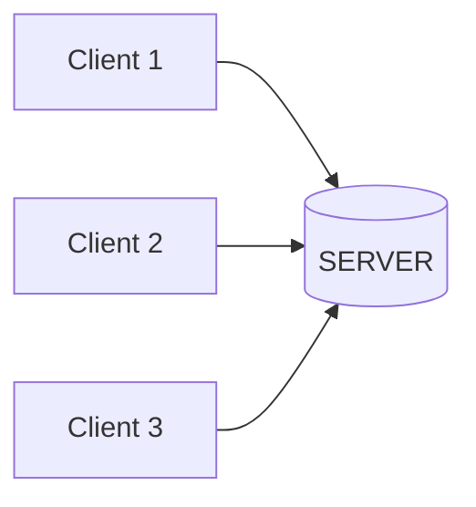

# Client-Server Socket Programming

## Purpose

To understand how socket communication works by building a real-time chat application using Python socket programming.

---

## What is a Socket?

A **socket** is an endpoint for communication between networked computers. It allows two programs (on the same or different devices) to communicate with each other over a network.

Think of a socket as a **virtual phone connection** where programs can send and receive data.

### Socket Components

- **IP Address** - The network address of the device (e.g., `192.168.1.10`)
- **Port Number** - A specific channel/door for the application (e.g., `5000`)
- **Protocol** - Communication rules (TCP for reliable, UDP for fast)

---

## Architecture



The server acts as a **central hub** that:

- Accepts connections from multiple clients
- Receives messages from clients
- Broadcasts/forwards messages to other clients

---

### Server Side

1. **CREATE** a socket with specified IP and PORT
2. **BIND** the socket to the address
3. **LISTEN** for incoming connections
4. **ACCEPT** client connections (creates new socket per client)
5. **RECEIVE** data from clients
6. **SEND** data to clients (broadcast or targeted)

### Client Side

1. **CREATE** a socket
2. **CONNECT** to server's IP and PORT
3. **SEND** messages to server
4. **RECEIVE** messages from server

### Multi-Threading

Both server and client use **multi-threading** to handle simultaneous operations:

**CLIENT** threads:
- Thread 1: Handle sending messages
- Thread 2: Handle receiving messages

**SERVER** threads:
- Thread 1: Handle server input/commands
- Thread N: Handle each connected client (one thread per client)

This allows **two-way communication** without blocking.

---

## Features Implemented

### Client Features

- ✅ Connect to server with username
- ✅ Send broadcast messages
- ✅ Send private messages (`:pm <user> <message>`)
- ✅ Create/join/leave groups
- ✅ Send messages to groups

### Server Features

- ✅ Accept multiple client connections
- ✅ Broadcast messages to all clients
- ✅ Handle private messaging between clients
- ✅ Manage group chats
- ✅ Admin commands:
  - `:list` - Show connected clients
  - `:kick <user>` - Disconnect a client
  - `:rename <old> <new>` - Rename a client
  - `:shutdown` - Stop the server

---

## Protocol: TCP vs UDP

This project uses **TCP (Transmission Control Protocol)**:

| TCP | UDP |
|-----|-----|
| ✅ Reliable delivery | ❌ May lose packets |
| ✅ Ordered packets | ❌ Unordered |
| ✅ Connection-oriented | ✅ Connectionless |
| ❌ Slower | ✅ Faster |
| 👍 Best for chat apps | 👍 Best for gaming/streaming |

---

## Setup & Usage

### Requirements

```bash
Python 3.x
```

### Running the Server

```bash
python server.py  
# Example:
python server.py 127.0.0.1 5000
```

### Running the Client
```bash
python client.py  
# Example:
python client.py 127.0.0.1 5000
```

---

## Commands

### Client Commands
| Command | Description |
|---------|-------------|
| `:pm <user> <msg>` | Send private message |
| `:group create <name>` | Create a group |
| `:group join <name>` | Join a group |
| `:group leave <name>` | Leave a group |
| `:group send <name> <msg>` | Send message to group |
| `:group members <name>` | List group members |

### Server Commands

| Command | Description |
|---------|-------------|
| `:list` | Show all connected clients |
| `:kick <user>` | Kick a client |
| `:rename <old> <new>` | Rename a client |
| `:shutdown` | Shutdown the server |

---

## Technical Stack

- **Language**: Python 3.x
- **Libraries**: 
  - `socket` - Network communication
  - `threading` - Concurrent operations
  - `sys` - System operations
  - `datetime` - Timestamps

---