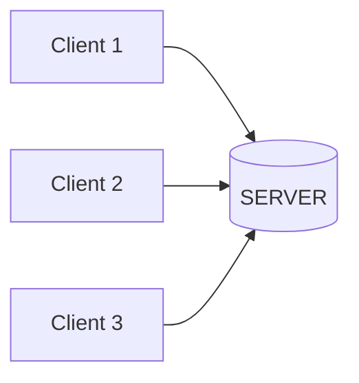

# Client-Server Socket Programming

## Purpose

To understand how socket communication works by building a real-time chat application using Python socket programming.

---

## What is a Socket?

A **socket** is an endpoint for communication between networked computers. It allows two programs (on the same or different devices) to communicate with each other over a network.

Think of a socket as a **virtual phone connection** where programs can send and receive data.

### Socket Components

- **IP Address** - The network address of the device (e.g., `192.168.1.10`)
- **Port Number** - A specific channel/door for the application (e.g., `5000`)
- **Protocol** - Communication rules (TCP for reliable, UDP for fast)

---

## Architecture



The server acts as a **central hub** that:

- Accepts connections from multiple clients
- Receives messages from clients
- Broadcasts/forwards messages to other clients

---

### Server Side

1. **CREATE** a socket with specified IP and PORT
2. **BIND** the socket to the address
3. **LISTEN** for incoming connections
4. **ACCEPT** client connections (creates new socket per client)
5. **RECEIVE** data from clients
6. **SEND** data to clients (broadcast or targeted)

### Client Side

1. **CREATE** a socket
2. **CONNECT** to server's IP and PORT
3. **SEND** messages to server
4. **RECEIVE** messages from server

### Multi-Threading

Both server and client use **multi-threading** to handle simultaneous operations:

**CLIENT** threads:

- Thread 1: Handle sending messages
- Thread 2: Handle receiving messages

**SERVER** threads:

- Thread 1: Handle server input/commands
- Thread N: Handle each connected client (one thread per client)

This allows **two-way communication** without blocking.

---

## Features Implemented

### Client Features

- ✅ Connect to server with username
- ✅ Send broadcast messages
- ✅ Send private messages (`:pm <user> <message>`)
- ✅ Create/join/leave groups (`:group <command_group> <group_name>`)
- ✅ Send messages to groups

### Server Features

- ✅ Accept multiple client connections
- ✅ Broadcast messages to all clients
- ✅ Handle private messaging between clients
- ✅ Manage group chats
- ✅ Admin commands:
  - `:list` - Show connected clients
  - `:kick <user>` - Disconnect a client
  - `:rename <old> <new>` - Rename a client
  - `:shutdown` - Stop the server

---

## Protocol: TCP vs UDP

This project uses **TCP (Transmission Control Protocol)**:

| TCP | UDP |
|-----|-----|
| ✅ Reliable delivery | ❌ May lose packets |
| ✅ Ordered packets | ❌ Unordered |
| ✅ Connection-oriented | ✅ Connectionless |
| ❌ Slower | ✅ Faster |
| 👍 Best for chat apps | 👍 Best for gaming/streaming |

---

## Setup & Usage

### Requirements

```bash
Python 3.x
```

### Running the Server

```bash
python server.py [ip_address] [port]
# Example:
python server.py 127.0.0.1 5000
```

### Running the Client

```bash
python client.py [ip_address] [port]
# Example:
python client.py 127.0.0.1 5000
```

---

## Commands

### Client Commands

| Command | Description |
|---------|-------------|
| `:pm <user> <msg>` | Send private message |
| `:group create <name>` | Create a group |
| `:group join <name>` | Join a group |
| `:group leave <name>` | Leave a group |
| `:group send <name> <msg>` | Send message to group |
| `:group members <name>` | List group members |

### Server Commands

| Command | Description |
|---------|-------------|
| `:list` | Show all connected clients |
| `:kick <user>` | Kick a client |
| `:rename <old> <new>` | Rename a client |
| `:shutdown` | Shutdown the server |

---

## Technical Stack

- **Language**: Python 3.x
- **Libraries**:
  - `socket` - Network communication
  - `threading` - Concurrent operations
  - `sys` - System operations
  - `datetime` - Timestamps

---

## Code Explanation

### Client Implementation (`client.py`)

#### TCPClient Class

The `TCPClient` class handles all client-side operations including connection management, message sending, and receiving.

#### `__init__()` Client Method

```python
def __init__(self):
    if len(sys.argv) != 3:
        print(RED + 'Usage: ' + sys.argv[0] + ' [server_ip] [port]' + RESET)
        sys.exit(1)
    else:
        self.HOST = sys.argv[1]          # Server IP address
        self.PORT = int(sys.argv[2])     # Server port
        self.client_name = ""            # Client username
        self.running = True              # Client running status
        self.sockTCP = None              # TCP socket
        self.reconnect_timeout = 120     # Reconnection timeout limit
        self.is_connected = False        # Connection status to server
```

This initialization method ensures users provide the correct server IP and port. If the arguments are invalid, the program terminates. When valid, it initializes essential variables including connection status, socket object, and reconnection parameters.

#### `safe_print()` Method

```python
def safe_print(self, msg):
    sys.stdout.write("\033[2K\r")
    print(msg)
    if self.is_connected:
        sys.stdout.write(CYAN + "YOU >> " + RESET)
    sys.stdout.flush()
```

This method prints server messages without interrupting the user's terminal input. This feature is crucial because the program uses multi-threading, allowing simultaneous message reception and user input.

#### `connect_to_server()` Method

```python
def connect_to_server(self):
    """Attempts connection to server"""
    try:
        self.sockTCP = socket(AF_INET, SOCK_STREAM)
        self.sockTCP.settimeout(5)  # Connection timeout
        self.sockTCP.connect((self.HOST, self.PORT))
        self.sockTCP.settimeout(None)  # Remove timeout after connected
       
        # Send name to server as first message
        self.sockTCP.send(self.client_name.encode())
        self.is_connected = True
        return True
    except Exception as e:
        if self.sockTCP:
            self.sockTCP.close()
        self.is_connected = False
        return False
```

This is the core connection function that creates a TCP socket, connects to the server, sends the client name as the first message, and marks the connection as established. It includes error handling to gracefully manage connection failures.

#### `attempt_reconnection()` Method

```python
while time.time() - start_time < self.reconnect_timeout and self.running:
    if self.connect_to_server():
        print(GREEN + "Reconnected successfully!" + RESET)
        return True
```

This function ensures the client doesn't immediately terminate when the server goes down. It attempts to reconnect every five seconds with a 120-second timeout limit, providing resilience against temporary network issues.

#### `Create()` Client Method

```python
def Create(self):
    # Input name first
    self.client_name = input(CYAN + "NAME : " + RESET)
   
    # Attempt first connection
    print(YELLOW + f"[{timestamp()}] Connecting to {self.HOST}:{self.PORT}..." + RESET)
   
    if not self.connect_to_server():
        print(RED + f"[{timestamp()}] Failed to connect to server {self.HOST}:{self.PORT}" + RESET)
       
        # Try reconnection
        if not self.attempt_reconnection():
            sys.exit(1)
```

This method prompts the user for their username and then sends it to the server as the first message. If the initial connection fails, it automatically attempts reconnection before terminating.

#### `handle_receive()` Method

```python
def handle_receive(self):
    while self.running:
        try:
            if not self.sockTCP or not self.is_connected:
                time.sleep(1)
                continue
               
            data = self.sockTCP.recv(1024)
            if not data:
                self.safe_print(RED + f"[{timestamp()}] Disconnected from server" + RESET)
                self.is_connected = False
               
                # Try reconnection
                if self.attempt_reconnection():
                    continue
                else:
                    self.running = False
                    break
                   
            message = data.decode()
```

This method handles incoming messages by receiving data in bytes and converting it to strings. It also monitors the connection status, detecting disconnections caused by server shutdown, network issues, or being kicked from the server, triggering automatic reconnection when appropriate.

---

### Server Implementation (`server.py`)

#### TCPServer Class

The `TCPServer` class manages all server-side operations including client connections, message broadcasting, and command processing.

#### `__init__()` Server Method

```python
def __init__(self):
    if len(sys.argv) != 3:
        print('Usage:' + sys.argv[0] + ' [ip address] [port]')
        sys.exit(1)
    else:
        self.HOST = sys.argv[1]
        self.PORT = int(sys.argv[2])

    self.running = True
    self.connections = []
    self.client_names = {}
    self.groups = {}
```

Initializes the server by accepting IP address and port as command-line arguments. If inputs are missing or invalid, it displays an error message. The method also initializes data structures for managing client connections, usernames, and group chats.

#### `Create()` Server Method

```python
def Create(self):
    try:
        self.sockTCP = socket(AF_INET, SOCK_STREAM)
        self.sockTCP.bind((self.HOST, self.PORT))
        self.sockTCP.listen(5)
    except Exception as e:
        print(RED + 'Failed to create TCP socket: ' + str(e) + RESET)
        sys.exit(1)
    else:
        print(GREEN)
        print(f"╔═════════════════════════════════════════╗")
        print(f"║   SERVER STARTED ({self.HOST}:{self.PORT})   ║")
        print(f"╚═════════════════════════════════════════╝" + RESET)
```

Creates and configures the server socket using IPv4 (`AF_INET`) and TCP (`SOCK_STREAM`). It binds the socket to the specified address and port, then starts listening for incoming connections. The method includes error handling and displays a formatted success message when the server starts successfully.

#### `Procesess()` Method

```python
def Procesess(self):
    threading.Thread(target=self.server_input, daemon=True).start()

    print(MAGENTA + f"[{timestamp()}] Waiting for client..." + RESET)

    while self.running:
        try:
            koneksi, alamat = self.sockTCP.accept()

            if not self.running:
                koneksi.close()
                break

            threading.Thread(
                target=self.handle_client,
                args=(koneksi, alamat),
                daemon=True
            ).start()
        except OSError:
            pass
```

After successful socket creation, this method starts the main server loop. It spawns a thread for handling server input (`server_input()`) and continuously accepts new client connections. For each new client, it creates a dedicated thread running `handle_client()` to manage that client's communication independently.

#### `server_input()` Method

```python
def server_input(self):
    while True:
        message = input(CYAN + "INPUT >> " + RESET)

        if message.startswith(":"):
            self.check_input(message)
            continue

        formatted = GREEN + f"[{timestamp()}] SERVER: {message}" + RESET
        print(formatted)

        self.broadcast(formatted)
```

Handles server administrator input from the command line. Messages starting with a colon (`:`) are treated as administrative commands and processed by `check_input()`. Regular messages are formatted with timestamps and broadcast to all connected clients.

#### `handle_client()` Method

```python
def handle_client(self, koneksi, alamat):
    client_name = koneksi.recv(1024).decode()
    self.client_names[koneksi] = client_name
    msg = CYAN + f"[{timestamp()}] Client {alamat[0]}:{alamat[1]} CONNECTED Name: {client_name}" + RESET
    self.safe_print(msg)
    self.broadcast(msg, sender=koneksi)

    self.connections.append(koneksi)
```

Manages individual client connections. When a new client connects, this method receives their username, stores it in the `client_names` dictionary, adds the connection to the `connections` list, and broadcasts the connection announcement to all other clients.

#### Receiving Data in `handle_client()`

```python
while True:
    try:
        data = koneksi.recv(1024)
        if not data:
            break
    except:
        break

    msg = data.decode()

    if msg.startswith(":"):
        self.check_input_user(koneksi, msg)
        continue

    formatted = YELLOW + f"[{timestamp()}] {self.client_names[koneksi]} >> " + RESET + msg
    self.safe_print(formatted)

    self.broadcast(formatted, sender=koneksi)
```

The server continuously receives data from each connected client. Messages starting with a colon (`:`) are processed as client commands through `check_input_user()`. Regular messages are formatted with the sender's name and timestamp, then broadcast to all other clients.

#### Client Disconnection Handling

```python
disconnect = RED + f"[{timestamp()}] {self.client_names[koneksi]} DISCONNECTED" + RESET
self.safe_print(disconnect + RED + f" ({alamat[0]}:{alamat[1]})" + RESET)
self.broadcast(disconnect, sender=koneksi)

if koneksi in self.connections:
    koneksi.close()
    self.connections.remove(koneksi)
```

When a client disconnects (either gracefully or due to network issues), the server broadcasts the disconnection message to all remaining clients, closes the socket, and removes the connection from the active connections list. This ensures clean resource management and keeps all clients informed of the network state.

---

## Key Concepts

### Threading Model

The application uses a multi-threaded architecture to enable simultaneous operations:

- **Client Side**: Two threads allow sending and receiving messages concurrently
- **Server Side**: Multiple threads handle each client independently plus one thread for server input
- **Benefits**: Non-blocking I/O, real-time communication, and improved user experience

### Connection Management

- **Initial Connection**: Client sends username as first message for identification
- **Heartbeat**: Detects disconnections through failed `recv()` calls
- **Reconnection**: Automatic reconnection attempts with configurable timeout
- **Graceful Shutdown**: Proper cleanup of sockets and resources

### Message Flow

1. Client sends message through socket
2. Server receives and decodes message
3. Server processes (command or broadcast)
4. Server forwards to appropriate recipients
5. Recipients receive and display message

---

## Project Structure

```bash
.
├── client.py          # Client implementation
├── server.py          # Server implementation
└── README.md          # This file
```

---

## Author

King Ardanu Egitya Ash SHafah (3124600100)
Saki kesayangan Mamah (3124600103)

---

## License

This project is available for educational purposes.
